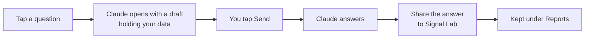

# Asking Claude about your results

The [Analyst](go:analyst) hands your record to the Claude app on this phone with a question, and Claude answers on your own Claude plan. Signal Lab has no AI of its own and pays for none: it only prepares the question and keeps the answer.

## How a question travels

1. **Tap a question.** Signal Lab opens the Claude app with a draft: the question, with your record's data below it. Claude asks where to put it: a new chat, or one you already have. Keeping one chat for Signal Lab lets Claude compare this week's answer with last week's.
2. **Tap Send in Claude.** Nothing leaves the phone until you do. You can read the draft first, change the question, or close it.
3. **Keep the answer.** Under Claude's answer, tap Share and choose Signal Lab, or tap Copy and then **Paste an answer** in the Analyst. The answer is kept under Reports, newest first.

## What the data holds

The scorecard, recent results against earlier ones, results by Bitcoin's trend, how trades ended, results by coin, your open trades and the latest hundred closed ones. "Explain a trade" adds that trade, the candles around it and the pattern's other trades on that coin. It is coin names and numbers, and nothing about you.

## The questions

| Question | What it asks |
|---|---|
| Weekly review | What helped and hurt in the last 7 days, and whether an exit looks set badly |
| What's fading? | Which patterns are getting worse, and which only look that way for want of trades |
| BTC regime check | Which patterns depend on Bitcoin being above or below its long average |
| Explain a trade | Why one closed trade won or lost, from its candles |
| 1h vs 4h | How each pattern does on each chart size you use |
| Suggest 3 patterns | New patterns for the [pattern lab](learn:pattern-lab), written so the app can test them |

Every question tells Claude to use only the numbers in the data, to name how many trades stand behind each claim, to respect the app's verdicts and the forward-only rule, and to give no instructions for trading real money.

## Honest limits

- **Claude can be wrong.** It reads the same numbers you see on the [Scorecard](go:scorecard); it does not have better ones. When Claude and the scorecard disagree, the scorecard's verdict stands, because it is the one corrected for every pattern tried. See [how the scorecard judges](learn:scorecard).
- **An idea Claude finds in your results is a guess until new trades test it.** A pattern shaped after looking at the results would be judged on live trades only, never on the history it was shaped from.
- **Answers use your Claude plan's limits.** Longer chats and the larger models use more of them.

> Research, not financial advice. No real money is ever traded.
