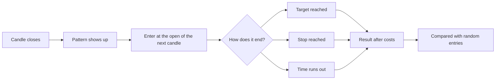

# What a practice trade is

> **In short:** A practice trade is a pretend trade. The app writes down what a pattern would have done, with real prices and real fees, and checks later how it turned out. No real money is ever involved.

A paper trade is a pretend trade. Signal Lab never touches your money and never places an order. It writes down what a pattern would have done, and checks later how that turned out.

## From signal to result

1. **A candle closes.** Signal Lab only looks at finished candles, never the one still forming.
2. **A pattern shows up** on a coin in one of your lists, on one of the chart sizes you chose for that list.
3. **The pretend trade enters at the open of the next candle.** That is the first price you could actually have had.
4. **It ends** in one of the ways below.
5. **Costs are charged** (see [What costs are charged](learn:costs)).
6. **The result is compared** with trades entered at random times (see [How we tell if it is working](learn:scorecard)).

## Missed signals

If Signal Lab notices a pattern after the entry candle has already ended, nobody could have acted on it. It is listed under **Missed** in [Alerts](go:alerts) and is never counted as a trade. Whether it was noticed in time depends only on the clock, never on how the trade would have turned out, so skipping them cannot flatter the scorecard.

## How a trade ends

A candle size means the average range of a candle over the last {{ATR_WINDOW}} candles (ATR). Using it keeps the levels sensible for both calm and wild coins.

| Kind of pattern | Exit |
|---|---|
| Trend, breakout, momentum, ranking, intraday breakout | **Trailing stop.** A safety stop {{TRAIL_STOP_ATR}} candle sizes below the entry. Once the price has risen {{TRAIL_ACTIVATE_ATR}} candle size, the stop starts following the highest close, staying {{TRAIL_DISTANCE_ATR}} candle sizes under it, and never moves down. There is also a time cap: {{TRAIL_CAPS}}. The intraday breakout also ends at the end of its UTC day. |
| Bullish Harami, Hikkake, drop fade | **Learned.** A target and a time limit taken from what the same pattern did after its earlier finished signals: the typical best rise, and how many candles it took. A safety stop sits {{LEARNED_STOP_ATR}} candle sizes below the entry. It needs {{LEARN_MIN_SIGNALS}} earlier signals on that coin, or on the whole list. With fewer than that it simply holds for {{LEARN_FALLBACK_BARS}} candles. |
| Day momentum, drop fade held 24 candles | **Held.** A fixed number of candles, no target and no stop. |

If a stop and a target are both touched inside one candle, Signal Lab assumes the stop came first. If the price jumps past a level, the trade closes at the first price after the jump, not at the level.

## One at a time

A pattern holds at most one open trade per coin. A new signal on the same coin and pattern is ignored until the first trade closes, so one move is not counted several times.

> Research, not financial advice. No real money is ever traded.
