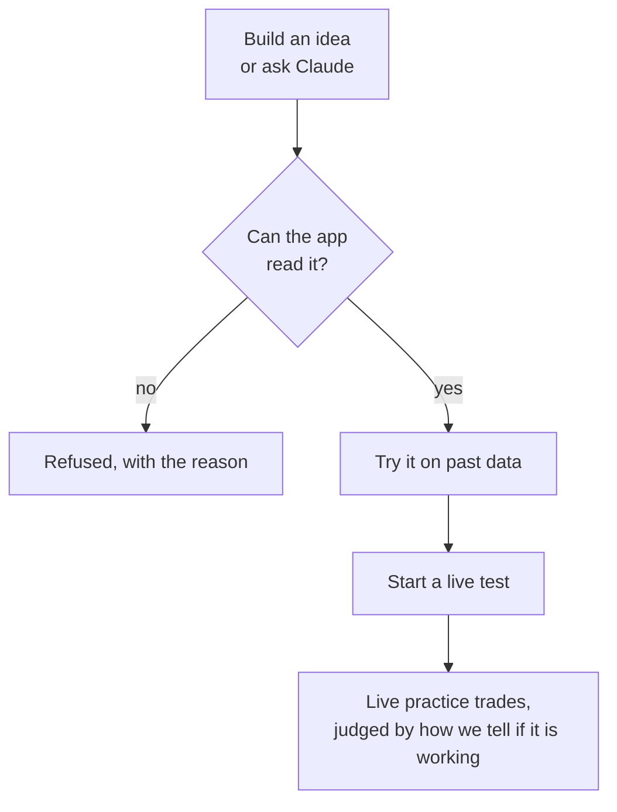

# The pattern lab

> **In short:** The lab is where you test your own ideas the same fair way as the built-in patterns: build one from simple pieces, try it on past data, then run it as a live practice test.

The lab tests new patterns that come from your own results. Claude suggests them from your record; Signal Lab tests them with the same rules as every built-in pattern: entry at the next candle's open, the same costs, the same random entries to beat.

## How an idea becomes a test

1. Open the **Lab** tab. Tap **Build your own** and choose the pieces, start from an example, or tap **Ask Claude for ideas** and paste the answer under Ask Claude.
2. Tap **Try it on past data** to see how the idea would have done on the history stored for your active lists. This is only for reference.
3. Tap **Start live test**. From the next candle on, the idea makes practice trades like any other pattern. It trades only on the chart sizes your active lists watch, so the app warns when one of its charts is not watched, and will not start an idea that no list watches at all.

## What a pattern can say

An idea is 1 to {{LAB_MAX_CONDITIONS}} conditions that must all hold on a candle, the chart sizes it runs on, and how its trades end. A condition compares two things: a price (open, high, low, close), the volume, an average (simple or exponential), RSI, the average true range, the highest high or lowest low of the candles before, the change over a number of candles, the volume against its average, or a plain number. Lengths run from {{LAB_MIN_N}} to {{LAB_MAX_N}} candles. A comparison is above, below, crosses above or crosses below.

A signal is the first candle on which every condition holds, read when that candle closes, exactly as for the built-in patterns. Trades end with a trailing stop, a profit goal and time limit learned from the pattern's earlier signals, or a fixed hold of up to {{LAB_MAX_HOLD}} candles. See [How a lab trade ends](learn:trailing).

The app reads a pattern; it never runs code. Anything outside this form is refused, and the report says why.

## Why lab patterns are judged on live trades only

A lab pattern was shaped after looking at your results, so its backtest flatters it: it was chosen because it would have done well. The backtest is shown for reference, and a lab pattern's verdict comes only from paper trades taken after it started. Its rows say **Lab, forward-only**. See [how we tell if it is working](learn:scorecard) and [why past results do not decide](learn:past-data).

## Why there is a limit

Every pattern tested raises the bar for every verdict, built-in ones included, because testing many ideas makes a few look good by luck. So the lab runs at most {{LAB_MAX_RUNNING}} ideas at once, and starts at most {{LAB_MAX_NEW}} new ones in any {{LAB_NEW_DAYS}} days. Stopping an idea ends its new trades. If it had fewer than 5 trades when you stopped it, it gives its place in the month back, because it never had the chance to look good by luck. It still counts among the patterns tested, so the bar it raised does not come back down.

## Honest limits

- **Most ideas will not beat random entries.** That is the usual result of a fair test, and it is worth knowing.
- **A good backtest proves little here.** Only the live trades count.
- **A stopped idea still counts as tested.** The bar it raised does not come back down.

> Research, not financial advice. No real money is ever traded.
