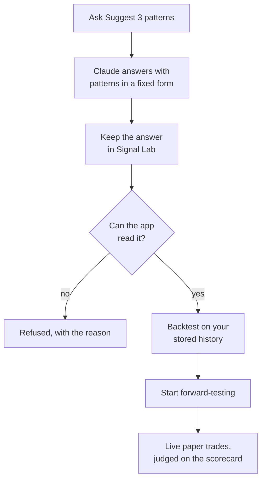

# The pattern lab

The lab tests new patterns that come from your own results. Claude suggests them from your record; Signal Lab tests them with the same rules as every built-in pattern: entry at the next candle's open, the same costs, the same random entries to beat.

## How an idea becomes a test

1. In the [Analyst](go:analyst), ask **Suggest 3 patterns** and send it in Claude.
2. Keep the answer in Signal Lab: Share it to Signal Lab, or Copy it in Claude and tap **Paste an answer**. A report that suggests patterns has a **Patterns** tab.
3. Each pattern can be **backtested** on the candles stored for your active lists, and **started**: from the next candle on, it trades on paper like any other pattern. It trades only on the chart sizes your active lists watch, so the app warns when one of its charts is not watched, and will not start a pattern that no list watches at all.

## What a pattern can say

A pattern is 1 to {{LAB_MAX_CONDITIONS}} conditions that must all hold on a candle, the chart sizes it runs on, and how its trades end. A condition compares two things: a price (open, high, low, close), the volume, an average (simple or exponential), RSI, the average true range, the highest high or lowest low of the candles before, the change over a number of candles, the volume against its average, or a plain number. Lengths run from {{LAB_MIN_N}} to {{LAB_MAX_N}} candles. A comparison is above, below, crosses above or crosses below.

A signal is the first candle on which every condition holds, read when that candle closes, exactly as for the built-in patterns. Trades end with a trailing stop, a target and time limit learned from the pattern's earlier signals, or a fixed hold of up to {{LAB_MAX_HOLD}} candles.

The app reads a pattern; it never runs code. Anything outside this form is refused, and the report says why.

## Why lab patterns are judged on live trades only

A lab pattern was shaped after looking at your results, so its backtest flatters it: it was chosen because it would have done well. The backtest is shown for reference, and a lab pattern's verdict comes only from paper trades taken after it started. Its rows say **Lab, forward-only**. See [how the scorecard judges](learn:scorecard).

## Why there is a limit

Every pattern tested raises the bar for every verdict, built-in ones included, because testing many ideas makes a few look good by luck. So the lab runs at most {{LAB_MAX_RUNNING}} patterns at once, and starts at most {{LAB_MAX_NEW}} new ones in any {{LAB_NEW_DAYS}} days. Stopping a pattern ends its new trades; its record, and its place in the count, stay.

## Honest limits

- **Most ideas will not beat random entries.** That is the usual result of a fair test, and it is worth knowing.
- **A good backtest proves little here.** Only the live trades count.
- **A stopped pattern still counts as tested.** The bar it raised does not come back down.

> Research, not financial advice. No real money is ever traded.
